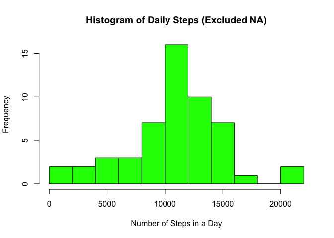
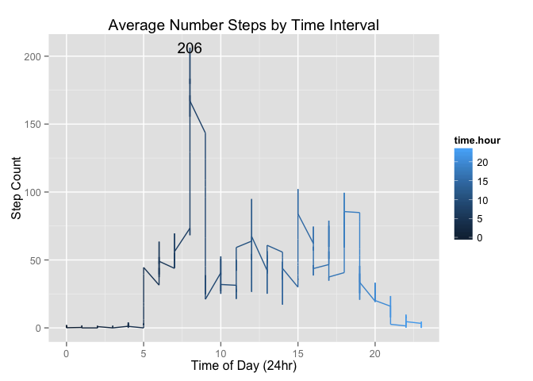
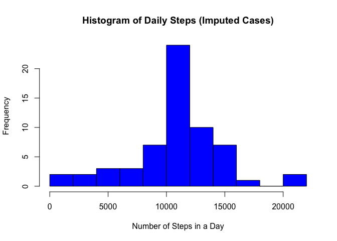
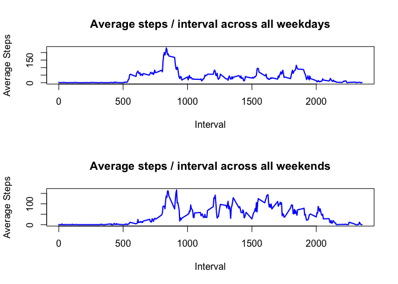

# Reproducible Research: Peer Assessment 1

## Introduction

This report makes use of data from a personal activity monitoring device. This device collects data at 5 minute intervals through out the
day. The data consists of two months of data from an anonymous individual collected during the months of October and November, 2012
and include the number of steps taken in 5 minute intervals each day.

## Data

The data for this assignment can be downloaded from the course web
site:

* Dataset: [Activity monitoring data](https://d396qusza40orc.cloudfront.net/repdata%2Fdata%2Factivity.zip) [52K]

The variables included in this dataset are:

* **steps**: Number of steps taking in a 5-minute interval (missing
    values are coded as `NA`)

* **date**: The date on which the measurement was taken in YYYY-MM-DD
    format

* **interval**: Identifier for the 5-minute interval in which
    measurement was taken   

The dataset is stored in a comma-separated-value (CSV) file and there are a total of 17,568 observations in this dataset.      

## Loading and preprocessing the data   
Unzip the downloaded file activity.zip and read the csv into variable activity.

Library ggplot2 is required for a time series plot


```r
library("ggplot2", lib.loc="/Library/Frameworks/R.framework/Versions/3.1/Resources/library")
```


```r
unzip("activity.zip")
activity <- read.csv("activity.csv")
```

Subset the data removing incomplete cases (`NA`), group the steps by day, calculate the total for each day, and store
in dataframe totalStepsByDay.     
Rename the columns in totalStepsByDay to date and total.steps.     

```r
activityCompleteCases <- data.frame(activity[complete.cases(activity),], row.names=NULL)
totalStepsByDay <- with(activityCompleteCases, aggregate(x=steps, by=list(date), FUN='sum'))
names(totalStepsByDay) <- c("date", "total.steps")
```

## What is the mean total number of steps taken per day?

Histogram breaks are set equal to *FD (Freedman-Diaconis)* rule which more accurately reflects this distribution than the default *Sturges* rule.


```r
hist(totalStepsByDay$total.steps, main="Histogram of Daily Steps (Excluded NA)", xlab="Number of Steps in a Day", col="green", breaks="FD")
```

 

The mean and median number of steps have been rounded because a **step** is a discrete measurement.   

```r
meanTotalDailySteps <- as.integer(round(mean(totalStepsByDay$total.steps)))
medianTotalDailySteps <- as.integer(round(median(totalStepsByDay$total.steps)))
```

The mean total number of steps taken per day is **10766**.      

The median total number of steps taken per day is **10765**.   


## What is the average daily activity pattern?

1. Make a time series plot (i.e. `type = "l"`) of the 5-minute interval (x-axis) and the average number of steps taken, averaged across all days (y-axis)   

Create a dataframe of the steps by 5 minute interval across all days

```r
aveStepsByTimeInterval <- with(activityCompleteCases, aggregate(x=steps, by=list(interval), FUN='mean') )
names(aveStepsByTimeInterval) <- c("interval", "mean.steps")
```

Check the first 13 rows

```r
head(aveStepsByTimeInterval, 13)
```

```
##    interval mean.steps
## 1         0  1.7169811
## 2         5  0.3396226
## 3        10  0.1320755
## 4        15  0.1509434
## 5        20  0.0754717
## 6        25  2.0943396
## 7        30  0.5283019
## 8        35  0.8679245
## 9        40  0.0000000
## 10       45  1.4716981
## 11       50  0.3018868
## 12       55  0.1320755
## 13      100  0.3207547
```

The intervals contain jumps when moving from 55 minute intervals to the next hour ex. 55 to 100.    

Create a new dataframe of the aveStepsByTimeInterval

```r
stepsByHour <- aveStepsByTimeInterval
```

Fix the intervals. 

```r
stepsByHour$interval <- seq(from=0,to=1435, by=5)
```

Create a function to convert the sequential steps to the 24 hr clock and return a column that denotes the hour.

```r
intervalToHr <- function(val){
        chrTime <- paste(as.integer(val/60),(val %% 60), sep=":")
        dateTimeFormat <- strptime(chrTime, format="%H")
        intTime <- as.integer(strftime(dateTimeFormat, format="%H"))
        return(as.character(intTime))
}

stepsByHour$time.hour <- as.integer(vapply(stepsByHour$interval, FUN=intervalToHr, FUN.VALUE="val"))
```

Check the first 13 rows

```r
head(stepsByHour, 13)
```

```
##    interval mean.steps time.hour
## 1         0  1.7169811         0
## 2         5  0.3396226         0
## 3        10  0.1320755         0
## 4        15  0.1509434         0
## 5        20  0.0754717         0
## 6        25  2.0943396         0
## 7        30  0.5283019         0
## 8        35  0.8679245         0
## 9        40  0.0000000         0
## 10       45  1.4716981         0
## 11       50  0.3018868         0
## 12       55  0.1320755         0
## 13       60  0.3207547         1
```

Plot the average number of steps by the 5 minute interval across all days

```r
g <- ggplot(data=stepsByHour,aes(x=time.hour, y=mean.steps)) 
g <- g + xlab("Time of Day (24hr)") + ylab("Step Count") + ggtitle("Average Number Steps by Time Interval")
g <- g + geom_line(aes(color=time.hour,group=1))
g <- g + geom_text(data=stepsByHour[104,], label=as.character(round(stepsByHour[104,2])))
g
```

 

2. Which 5-minute interval, on average across all the days in the dataset, contains the maximum number of steps?

Use the row index of the maximum average number of steps from mean.steps and use the row index to retrieve the corresponding time interval.


```r
maxStepsIndx <-  which.max(aveStepsByTimeInterval$mean.steps)
```


```r
aveStepsByTimeInterval$interval[maxStepsIndx]
```
The 5 minute interval that on average across all days contains the maximum number of steps is **835**.


## Imputing missing values   

There are a number of days/intervals where there are missing values (coded as `NA`). The presence of missing days may introduce bias into some calculations or summaries of the data.   

1. Calculate and report the total number of missing values in the dataset (i.e. the total number of rows with `NA`)


```r
activityIncompleteCases <- data.frame(activity[!complete.cases(activity),], row.names=NULL) 
```


```r
numberOfMissingValues <- nrow(activityIncompleteCases) 
```

The number of missing values is **2304**

2. Devise a strategy for filling in all of the missing values in the dataset.    
To account for missing values the mean for the corresponding 5 minute interval across all days will be used.   

3. Create a new dataset that is equal to the original dataset but with the missing data filled in.


```r
meanActivityIncompleteCases <- merge(activityIncompleteCases[, c("date", "interval")], aveStepsByTimeInterval, by="interval")
```
The 'by' column must specify a uniquely valid column. meanActivityIncompleteCases is ordered by the interval rather than date and the columns are in a different order than in activityCompleteCases.

Fix the column names and create a new dataframe with the columns in the correct order.


```r
colnames(meanActivityIncompleteCases) <- c("interval", "date", "steps")
orderedMeanActivityIncompleteCases<- with(meanActivityIncompleteCases, data.frame(steps, date, interval))
```

Create a new dataframe with the complete cases and incomplete cases. 

```r
allNewCases <- rbind(activityCompleteCases, orderedMeanActivityIncompleteCases)
```

The incomplete cases are still ordered by interval. Create a new dataframe with the cases ordered by date.

```r
orderAllCases <- allNewCases[with(allNewCases, order(date, interval)), ]
```

Make a histogram of the total number of steps taken each day and Calculate and report the **mean** and **median** total number of steps taken per day.


```r
totalStepsAllCases <- with(orderAllCases, aggregate(x=steps, by=list(date), FUN='sum'))
colnames(totalStepsAllCases) <- c("date", "total.steps")
```

This histogram will also use breaks set equal to the *FD (Freedman-Diaconis)* rule as used with the data that excluded `NA`.      


```r
hist(totalStepsAllCases$total.steps, main="Histogram of Daily Steps (Imputed Cases)", xlab="Number of Steps in a Day", col="blue", breaks="FD")
```

 


Do these values differ from the estimates from the first part of the assignment?    


```r
meanDailyStepsAllCases <- as.integer(round(mean(totalStepsAllCases$total.steps)))
medianDailyStepsAllCases <- as.integer(round(median(totalStepsAllCases$total.steps)))
```

The mean total number of steps taken per day is **10766**.      

The median total number of steps taken per day is **10766**.   


Compare the mean and median values between the data that excluded NA and the data that imputed values for NA.


Data Set            | Mean                      | Median      
--------------------|---------------------------|--------------------      
Excluded NA         | 10766   | 10765                                   
Imputed NA          | 10766|10766   

There is no difference between the mean of the data that ignored (excluded) NA values and the data that had values imputed. There is a minimal difference of one step between the medians of these data sets.

What is the impact of imputing missing data on the estimates of the total daily number of steps?

If missing values had been replaced by 0 then the mean would have substantially decreased. Imputing the mean of the corresponding 5 minute interval therefore prevented bias of the mean, however, it does artificially inflate actual **totals** and should be used carefully and in a consistent manner.

## Are there differences in activity patterns between weekdays and weekends?   

1. Create a new factor variable in the dataset with two levels -- "weekday" and "weekend" indicating whether a given date is a weekday or weekend day.


```r
days <- weekdays(as.POSIXlt(orderAllCases$date))
rowIndx <- 0
dayType <- function(val){
   rowIndx <<- rowIndx + 1
  if(val=="Saturday" | val=="Sunday"){
        val = "Weekend"
        
  } else {
        val = "Weekday"
  }
  days[[rowIndx]] <<- val
}
tmpVar <- vapply(days, FUN=dayType, FUN.VALUE="val")
```


```r
days <- factor(days, levels=c("Weekday", "Weekend"))
```


```r
str(days)
```

```
##  Factor w/ 2 levels "Weekday","Weekend": 1 1 1 1 1 1 1 1 1 1 ...
```

2. Make a panel plot containing a time series plot (i.e. `type = "l"`) of the 5-minute interval (x-axis) and the average number of steps taken, averaged across all weekday days or weekend days (y-axis). 


```r
orderAllCases$day.type <- as.vector(days)
averageByDayType <- with(orderAllCases, aggregate(x=steps, by=list(interval, day.type), FUN='mean'))
```

Get the first 6 rows of data and the data frames dimensions


```r
        names(averageByDayType) <- c("interval", "day.type", "average")
        head(averageByDayType) 
```

```
##   interval day.type    average
## 1        0  Weekday 2.25115304
## 2        5  Weekday 0.44528302
## 3       10  Weekday 0.17316562
## 4       15  Weekday 0.19790356
## 5       20  Weekday 0.09895178
## 6       25  Weekday 1.59035639
```

```r
        dim(averageByDayType)
```

```
## [1] 576   3
```

```r
        averageByDayTypeList <- split(x=averageByDayType, f=averageByDayType$day.type)
        weekdays = data.frame(averageByDayTypeList[[1]])
        weekends = data.frame(averageByDayTypeList[[2]])
```


Plot average for weekdays and weekends

```r
par(mfcol=c(2,1))


with(weekdays, plot(interval, average, type="l",
     main="Average steps / interval across all weekdays", 
     xlab="Interval", ylab="Average Steps", 
     lwd=2, col="blue"))
with(weekends, plot(interval, average, type="l",
     main="Average steps / interval across all weekends", 
     xlab="Interval", ylab="Average Steps", 
     lwd=2, col="blue"))
```

 


The plots show that the most steps tend to be around the same interval on weekends and weekdays. Weekends, however, show much greater activity during daytime hours and to a later time than on weekdays. 

